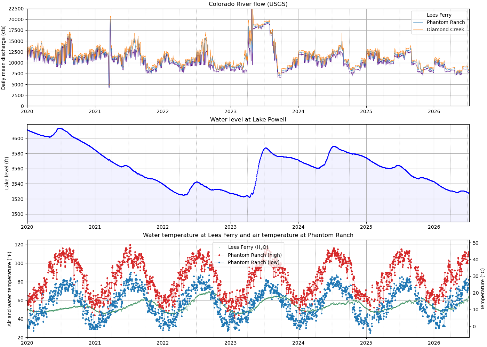
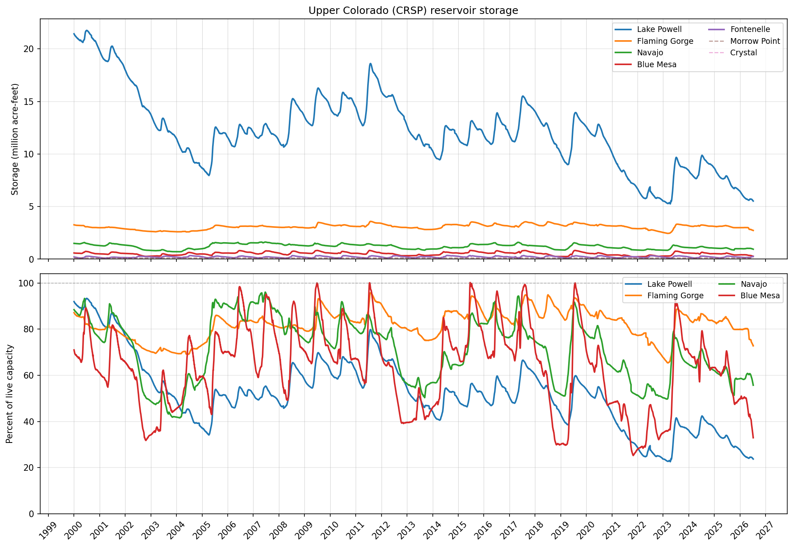
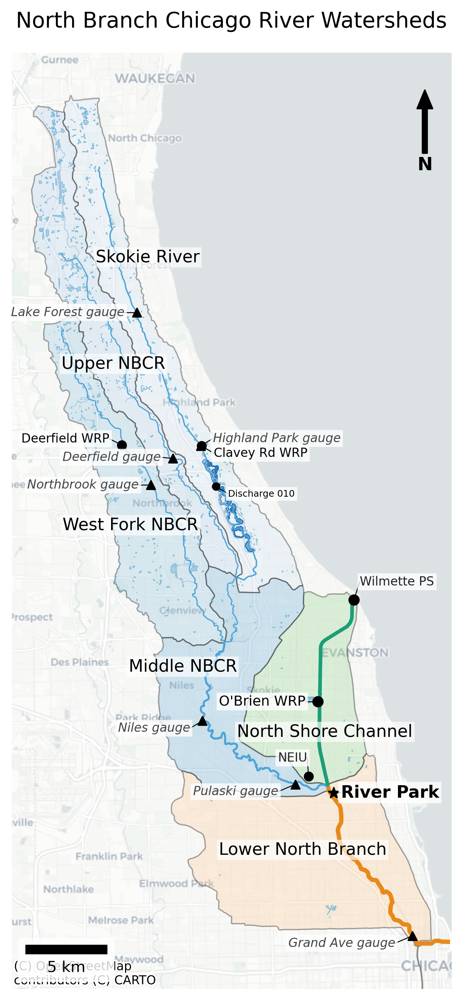

# River Conditions and Environments with Python

Python notebooks and reusable tools for exploring river environments using public data from the USGS, NOAA, and the Bureau of Reclamation.

The repository combines **river discharge, reservoir operations, water temperature, air temperature, climate observations, watersheds, flowlines, and geographic context**. Some notebooks are scientific and educational; others summarize the practical conditions that matter when traveling on a river, including flow, water temperature, heat, and reservoir releases.

The current examples focus on the **Colorado River through the Grand Canyon** and the **North Branch Chicago River**, with additional watersheds planned.

<p align="center">
  
</p>

## Example Analyses

### Grand Canyon river conditions

`grand_canyon/grand_canyon_conditions.ipynb` combines several environmental data sources to describe conditions along the Colorado River corridor:

- Colorado River discharge at Lees Ferry, Phantom Ranch, and Diamond Creek;
- Lake Powell water-surface elevation;
- Lees Ferry water temperature; and
- Phantom Ranch air temperature.

These variables are useful for studying hydrology and reservoir operations, but they are also directly relevant to rafting conditions in the canyon.

[](https://colab.research.google.com/github/gregorywanderson/rivers/blob/main/grand_canyon/grand_canyon_conditions.ipynb)

### Upper Colorado River Storage Project

`grand_canyon/crsp.ipynb` downloads reservoir-storage data from the Bureau of Reclamation RISE API and compares the seven major Colorado River Storage Project reservoirs.

The figure shows both:

1. absolute storage in million acre-feet; and
2. percent of live capacity for the four major storage reservoirs.

<p align="center">
  
</p>

[](https://colab.research.google.com/github/gregorywanderson/rivers/blob/main/grand_canyon/crsp.ipynb)

### Chicago urban watersheds

`chicagoland/nbcr.ipynb` maps the North Branch Chicago River and North Shore Channel system using watershed boundaries, NHDPlus flowlines, USGS streamgages, and water-resource infrastructure.

<p align="center">
  
</p>

## Repository Organization

```text
rivers/
├── national_map_client.py      # USGS National Map client
├── ncei_io.py                  # NOAA NCEI data access
├── usgs_io.py                  # USGS Water Data wrangling helpers
├── README.md
├── environment.yml
├── pyproject.toml
├── figures/
│   └── github/                 # README graphics
├── chicagoland/
│   ├── nbcr.ipynb
│   └── figures/
└── grand_canyon/
    ├── grand_canyon_conditions.ipynb
    ├── crsp.ipynb
    ├── images/
    └── figures/
```

Shared modules remain at the repository root so they can be imported by notebooks in any watershed-specific subdirectory.

Future watershed studies can be added as additional directories without duplicating the common data-access and plotting infrastructure.

## Shared Utilities

### `national_map_client.py`

Queries the USGS National Map for:

- Watershed Boundary Dataset polygons;
- NHD and NHDPlus flowlines; and
- waterbodies and related geographic layers.

### `ncei_io.py`

Retrieves climate and weather observations from NOAA's National Centers for Environmental Information.

### `usgs_io.py`

Provides helper functions for working with the modern `dataretrieval.waterdata` API, including:

- converting returned long-format tables into time-indexed DataFrames;
- reshaping parameter records into wide form; and
- standardizing datetime and timezone handling.

## Notebooks

### `chicagoland/nbcr.ipynb`

Builds a watershed map of the North Branch Chicago River system showing:

- HUC-12 subwatersheds;
- NHDPlus flowlines scaled by mean annual discharge;
- USGS gage locations; and
- water-resource facilities.

The notebook was developed for environmental-science education and local watershed analysis.

### `grand_canyon/grand_canyon_conditions.ipynb`

Plots river, reservoir, and weather conditions in the Grand Canyon corridor using USGS and NOAA data.

The notebook produces:

1. a multi-year daily-values figure showing river discharge, Lake Powell elevation, Lees Ferry water temperature, and Phantom Ranch air temperature; and
2. a higher-frequency continuous-values plot over a configurable period.

### `grand_canyon/crsp.ipynb`

Downloads and plots multi-year storage for:

- Lake Powell;
- Flaming Gorge;
- Navajo;
- Blue Mesa;
- Fontenelle;
- Morrow Point; and
- Crystal.

The notebook uses the Bureau of Reclamation's RISE API and highlights both long-term drought drawdown and seasonal snowmelt cycles.

## Quick Start

### Create the environment

Using conda or Miniforge:

```bash
conda env create -f environment.yml
conda activate rivers
```

Or using pip:

```bash
pip install -r requirements.txt
pip install -e .
```

For the Grand Canyon notebooks, the principal packages include:

```bash
pip install pandas matplotlib requests dataretrieval
```

Mapping notebooks also use packages such as:

```bash
pip install geopandas contextily
```

## Example: Fetch Watersheds

```python
from national_map_client import WBDClient

wbd_client = WBDClient()

watersheds = wbd_client.query(
    huc_prefix="07120003",
)

print(f"Found {len(watersheds)} HUC-12 watersheds")

watersheds.plot()
```

## Example: Fetch NHDPlus Flowlines

```python
from national_map_client import NHDPlusFlowlineClient

nhd_client = NHDPlusFlowlineClient()

flowlines = nhd_client.query(
    mask=watersheds,
    normalize_columns=True,
)

print(f"Found {len(flowlines)} flowlines")
```

## Data Sources

All data are retrieved from public agency services.

| Dataset | Source | Access |
|---|---|---|
| Watershed Boundary Dataset | USGS / USDA / NRCS | USGS National Map |
| NHD and NHDPlus flowlines | USGS | USGS National Map |
| River discharge and water temperature | USGS Water Data | `dataretrieval.waterdata` |
| Lake Powell elevation | USGS Water Data and Bureau of Reclamation | USGS / USBR |
| Climate and weather observations | NOAA NCEI | `ncei_io.py` |
| CRSP reservoir storage | Bureau of Reclamation | RISE API |

USGS and NOAA observations are generally in the public domain.

## Notes on USGS Water Data

The Grand Canyon notebook uses the modern `waterdata` module from the USGS `dataretrieval` Python package:

- `waterdata.get_daily()` for daily values;
- `waterdata.get_continuous()` for higher-frequency observations.

The API returns long-format tables with fields such as:

```text
monitoring_location_id
parameter_code
statistic_id
time
value
```

Functions in `usgs_io.py` convert these tables into forms suitable for plotting and exploratory analysis.

Useful references:

- https://doi-usgs.github.io/dataretrieval-python/
- https://help.waterdata.usgs.gov/codes-and-parameters/parameters
- https://waterdata.usgs.gov/
- https://maps.waterdata.usgs.gov/mapper/

## Notes on NOAA NCEI Data

The Grand Canyon notebook uses `ncei_io.py` to retrieve Phantom Ranch air-temperature observations from NOAA's GHCN-Daily archive.

The station used is:

```text
USC00026471
```

Useful references:

- https://www.ncei.noaa.gov/
- https://www.ncei.noaa.gov/cdo-web/search?datasetid=GHCND

## Requirements

- Python 3.11 or later
- See `environment.yml` for the complete environment

Important dependencies include:

- `pandas`
- `matplotlib`
- `requests`
- `dataretrieval`
- `geopandas`
- `contextily`

Different notebooks use different subsets of these packages.

## License

Copyright (C) 2025 Gregory Anderson

This program is free software: you can redistribute it and/or modify it under the terms of the [GNU General Public License v3](LICENSE), as published by the Free Software Foundation.

## Contributing

Contributions, bug reports, and suggestions are welcome through [GitHub Issues](https://github.com/gregorywanderson/rivers/issues).
